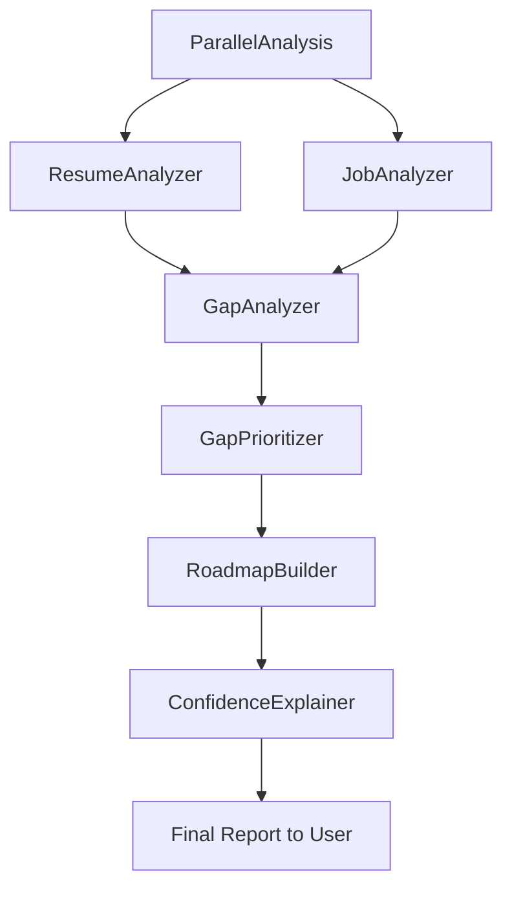

# CareerAI

CareerAI is a multi-agent career analysis application built with Google ADK and FastAPI.  
It compares a resume with a job description, identifies and prioritizes gaps, and generates a practical learning roadmap.

---

## Key features

- Parallel resume & job analysis
- Gap detection and prioritized skill recommendations
- Weekly learning roadmaps
- Confidence-scored final report
- ADK + FastAPI architecture for interactive UI and API

---

## Repository layout

- `adk_apps/careerpilot_ai/` — ADK app entrypoint (package: `agent.py`)  
- `careerpilot-backend/` — backend service (FastAPI, agents, models, runner)  
- `start_adk_web.ps1` — reliable ADK Web launcher (PowerShell)  
- `.venv/` — recommended local virtual environment (not checked in)  
- `README.md` — this file

---

## Quick start (recommended)

1. Open a terminal at the workspace root.

2. Activate venv
- PowerShell:
```powershell
.\.venv\Scripts\Activate.ps1
```
- Git Bash:
```bash
source .venv/Scripts/activate
```

3. Start ADK Web (run from `adk_apps` so only the intended ADK app is discovered):
```powershell
cd adk_apps
adk web
# then open http://localhost:8000
```
Or use helper:
```powershell
powershell -ExecutionPolicy Bypass -File .\start_adk_web.ps1
```

4. (Optional) Run backend API locally:
```powershell
Set-Location .\careerpilot-backend
python run.py
```

---

## Backend (CareerPilot Backend)

Backend overview:
- `careerpilot-backend/app/main.py` — FastAPI app & endpoints  
- `careerpilot-backend/app/models.py` — request/response schemas  
- `careerpilot-backend/app/agents/` — agents implementing analysis & strategy  
- `careerpilot-backend/app/services/workflow_runner.py` — orchestration layer  
- `careerpilot-backend/run.py` — local entrypoint

Install backend deps:
```bash
cd careerpilot-backend
pip install -r requirements.txt
```

Environment (example `.env`):
```env
OPENAI_API_KEY=...
OPENAI_MODEL=gpt-4o-mini
OPENAI_TIMEOUT_SECONDS=45
OPENAI_MAX_RETRIES=1
OPENAI_TOP_P=0.1
```

API endpoints:
- `GET /api/health`  
- `POST /api/analyze` — body: `{ "resume_text": "...", "job_description_text": "..." }`

ADK integration: `adk_apps/careerpilot_ai/agent.py` imports `root_agent` from `careerpilot-backend/app/agents/adk_root_agent.py`.

---

## Agent workflow (top → down)



Short flow: Resume + Job → ParallelAnalysis (ResumeAnalyzer & JobAnalyzer) → GapAnalyzer → GapPrioritizer → RoadmapBuilder → ConfidenceExplainer → Final Report.

---

## Troubleshooting (common issues)

- "module 'X' has no attribute 'agent'": run `adk web` from `adk_apps` or ensure `__init__.py` exposes `agent` (e.g., `from . import agent`).  
- Duplicate apps in ADK UI: ensure CWD is `adk_apps` when running `adk web` or remove shim modules.  
- Stale graph after code changes: stop ADK, run `adk web --reload_agents`, hard-refresh the browser (Ctrl+F5), and start a new session.  
- `adk` resolves to wrong exe: activate the workspace venv before running or use `start_adk_web.ps1`.

---

## Development & tests

- Run tests:
```bash
cd careerpilot-backend
pytest
```
- Lint/format:
```bash
black careerpilot-backend
flake8 careerpilot-backend
```

---

## Git workflow (safe push)

1. Review:
```bash
git status
git diff -- README.md
```
2. Stage intended files only:
```bash
git add README.md adk_apps/careerpilot_ai/__init__.py careerpilot-backend/app/agents/adk_root_agent.py
```
3. Commit & push:
```bash
git commit -m "docs: unified README with simplified agent workflow"
git pull --rebase origin main
git push origin main
```

If duplicate commits exist, run interactive rebase before pushing:
```bash
git fetch origin
git rebase -i origin/main
git push origin main --force-with-lease
```

---

## Notes

- Prefer running ADK from `adk_apps` to control app discovery.
- Keep pipeline concise: collapse unused formatter agents into the final explainer when safe.
- After code changes, create a fresh ADK session to view updated traces.
