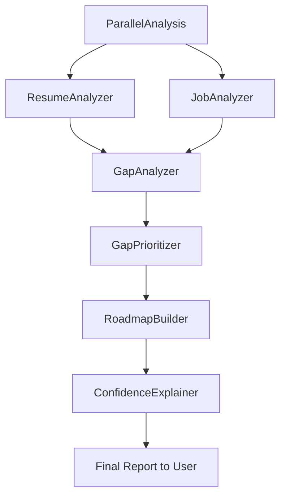

# CareerAI

CareerAI is a multi-agent career analysis app built with Google ADK + FastAPI.
It compares a resume with a job description, finds gaps, prioritizes actions, and generates a roadmap.

## Workspace Structure

- `adk_apps/careerpilot_ai/` - ADK app entrypoint (`agent.py`)
- `careerpilot-backend/` - backend models, agents, and API
- `start_adk_web.ps1` - helper script to launch ADK Web

## Quick Start

### 1) Activate virtual environment (workspace root)

```powershell
.\.venv\Scripts\Activate.ps1
```

### 2) Run ADK Web (simple)

Open terminal in `adk_apps` and run:

```powershell
adk web
```

Then open: `http://localhost:8000`

### 3) Run backend API (optional)

```powershell
Set-Location .\careerpilot-backend
python run.py
```

## Agent Workflow



## Output Sequence

1. Resume + job are analyzed in parallel.
2. Skill and experience gaps are identified.
3. Missing skills are prioritized.
4. Weekly roadmap is generated.
5. Final user-facing report is returned.

## Notes

- For ADK app usage, run from `adk_apps` so only `careerpilot_ai` is discovered.
- If UI looks stale after code changes, restart ADK and create a new session.
- Detailed backend docs are in `careerpilot-backend/README.md`.
